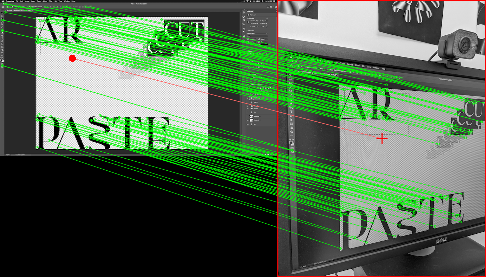

# ScreenPoint

Finds the (x,y) coordinates of the centroid of an image (eg: a mobile phone camera image) pointing at another image (eg: a computer screen) using [OpenCV SIFT](https://docs.opencv.org/2.4/modules/nonfree/doc/feature_detection.html).



## Installation

```bash
pip install screenpoint
```

## Usage

```python
import screenpoint
import cv2

# Load input images.
screen = cv2.imread('screen.png', 0)
view = cv2.imread('view.jpg', 0)

# Project view centroid to screen space.
# x and y are the coordinate of the `view` centroid in `screen` space.
x, y = screenpoint.project(view, screen)
```

See [example.py](example.py) for more information.
